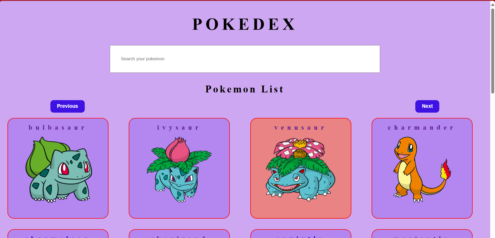
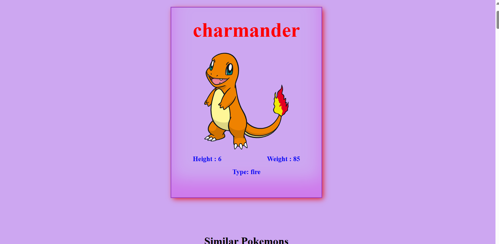
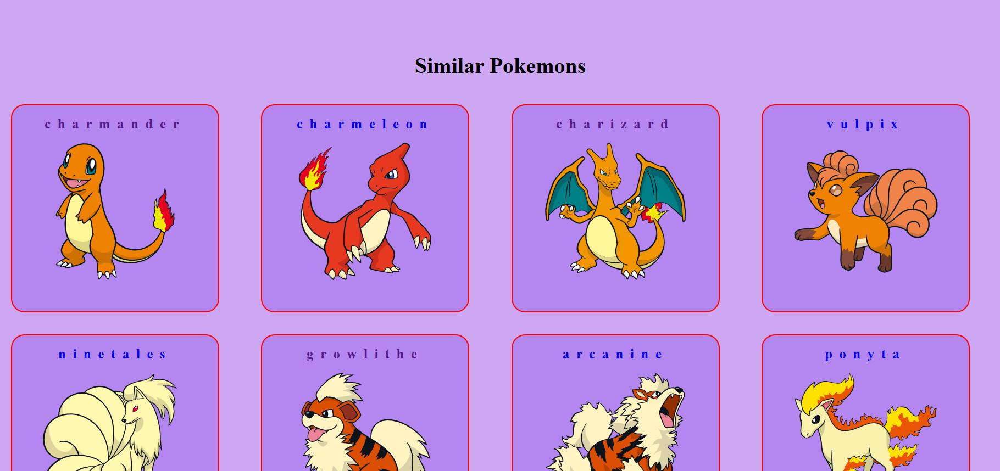

# Pokedex (A Pokemon App)

Welcome to the Pokedex App! This application allows users to browse through a comprehensive list of Pokémon, view details about each Pokémon, and discover similar Pokémon.

## Features

- **Browse Pokémons:** View a list of Pokémon, organized page-wise for easy navigation.
- **View Pokémon Details:** Click on any Pokémon to view detailed information about its types, height and weight.
- **Discover Similar Pokémon:** While viewing a Pokémon's details, discover similar Pokémon based on type, abilities, and other characteristics.

## Technologies Used
- **React**: Frontend JavaScript library for building user interfaces.
- **API:** The app utilizes the Pokémon API to fetch data about various Pokémon species.
- **Backend:** No backend is used as the application fetches data directly from the API.

## Screenshots

### Screenshot 1

### Screenshot 2

### Screenshot 3

## Usage

Whether you're a seasoned Pokémon trainer or just starting your journey, the Pokedex App is your ultimate companion for all things Pokémon. Here's how you can make the most out of it:

1. **Explore Pokémon World:** Dive into the vast world of Pokémon by browsing through a comprehensive list of Pokémon species. Whether you're looking for your favorite Pokémon or discovering new ones, the Pokedex has you covered.

2. **Learn About Pokémon:** Click on any Pokémon to unveil a treasure trove of information about its types, height and more. 

3. **Discover Similar Pokémon:** Uncover hidden gems and find new favorites by exploring similar Pokémon based on shared characteristics such as type, abilities, and more. With the Pokedex's intuitive interface, discovering new Pokémon has never been easier.

4. **Enhance Your Pokémon Knowledge:** Whether you're a casual fan or a dedicated trainer, the Pokedex App is your go-to resource for expanding your Pokémon knowledge. From legendary Pokémon to rare finds, there's always something new to discover with the Pokedex.
